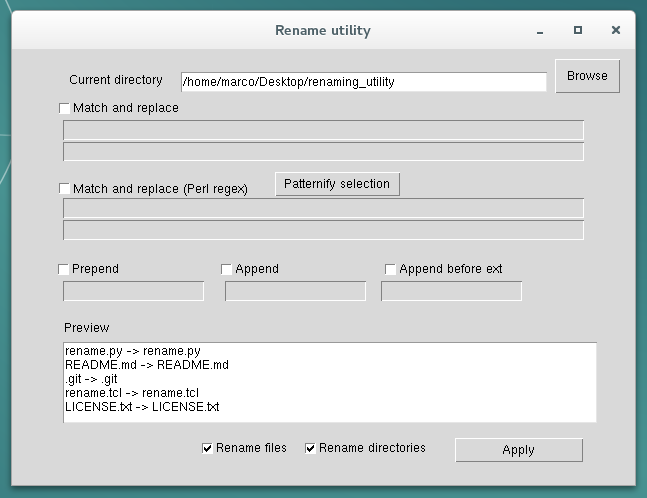

This is a simple utility for renaming files in batch.
It is GUI based, and is pretty simple to use.

Features:
 - Preview of renaming
 - Prepend string
 - Append string
 - Append string before file extension
 - String replacement
 - Regular expression (Perl) replacement
 - Patternify button to try to infer a pattern in selected text

I tested it with Python 2.7 and 3.5 under Linux.
If you successfully run it on other platforms, please let me know!

To execute it, run `python rename.py`.

This application comes with no guarantees. Use at your own risk.

Author: Marco Tamassia

Email: tamassia.marco@gmail.com

Acknowledgements:

The GUI was designed using PAGE - Python Automatic GUI Generator.

Homepage: http://page.sourceforge.net/
